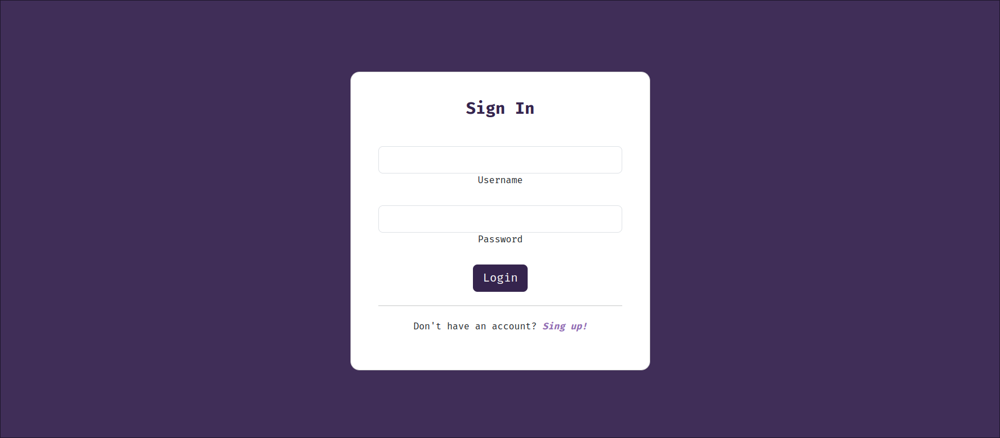
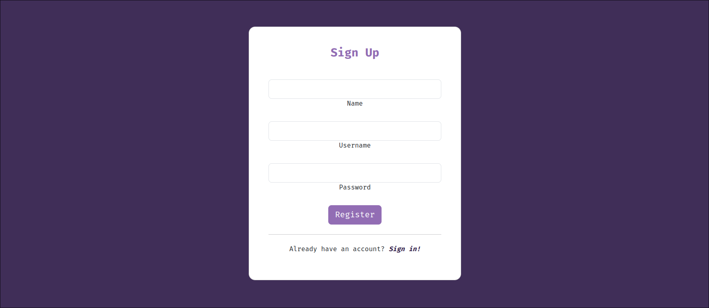
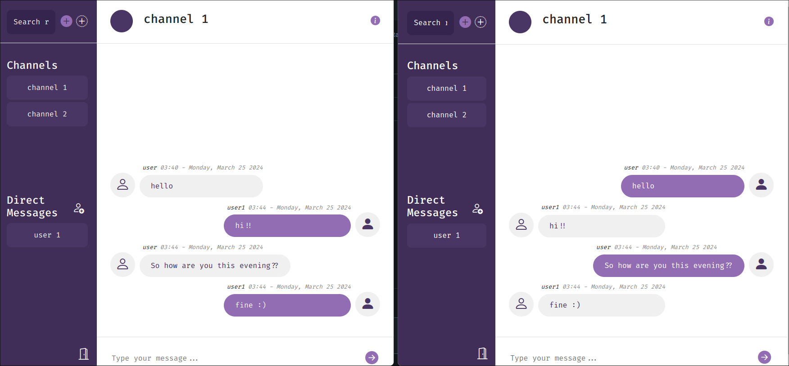

# VioletVibe - Chatapp
This project represents an Angular real time chat application. It allows user to communicate in real time directly or in group chats while offering
a clean and easy to use user interface. The overall theme of this project is purple hence the name: VioletVibe. 
This project also offers user authentication for secure access.

## Features
1. Users can communicate in real time
2. Users can create, join and chat in different available chat rooms
3. Simple and interactive user interface
4. Security provided through user authentication
5. Lazy loading modules

## Getting started
Please replace the occurrence of you `{your-local-ip}` in `SocketIOService`
```
  private readonly url: string = 'http://{your-local-ip}:8081';
```
with your local IP address in the source code. This is necessary for the socket communication.

## Screenshots
### LoginPage
<p align="center"></p>

### SignUpPage
<p align="center"></p>

### Room Chat Page
<p align="center"></p>

